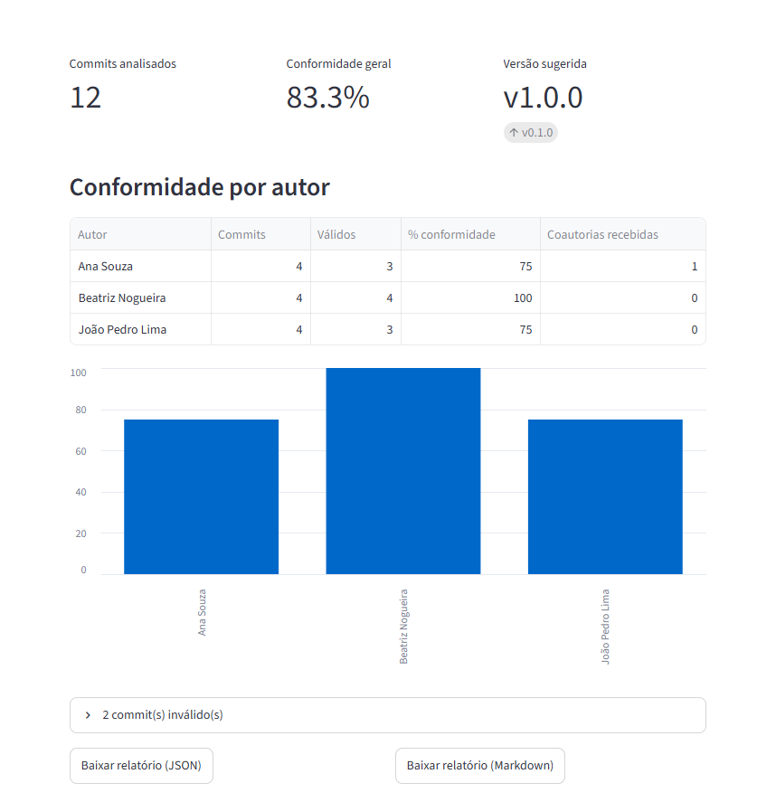
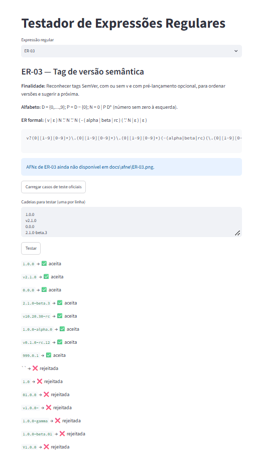

<link rel="stylesheet" href="estilo.css">

<div class="capa">

<div class="instituicao">
Disciplina de Linguagens Formais e Autômatos
</div>

# Commitômetro

## Auditor de Convenções de Commits e Versionamento em Repositórios Git, baseado em Expressões Regulares e Autômatos Finitos

Relatório técnico

Gabriel Miranda · Yago Schnorr · João Pedro Silva

<div class="data">
2026
</div>

</div>

## Sumário

1. [Resumo](#1-resumo)
2. [Introdução](#2-introdução)
3. [Fundamentação teórica](#3-fundamentação-teórica)
4. [Arquitetura e implementação](#4-arquitetura-e-implementação)
5. [Expressões regulares](#5-expressões-regulares)
6. [Autômatos finitos com movimentos vazios (AFNε)](#6-autômatos-finitos-com-movimentos-vazios-afnε)
7. [Testes e análise dos resultados](#7-testes-e-análise-dos-resultados)
8. [Resultados da aplicação](#8-resultados-da-aplicação)
9. [Limitações e melhorias](#9-limitações-e-melhorias)
10. [Contribuições](#10-contribuições)
11. [Conclusão](#11-conclusão)
- [Referências](#referências)
- [Apêndices](#apêndices)

## 1. Resumo

Convenções de mensagem de commit, versionamento e nomenclatura de branch costumam ser
seguidas "de memória" em projetos colaborativos, sem verificação automática — e desvios só
aparecem quando já causaram um problema no histórico. O **Commitômetro** resolve isso
auditando o histórico de um repositório Git (local ou exportado em arquivo) com **seis
expressões regulares**, formalizadas a partir de convenções reais de mercado (Conventional
Commits, SemVer, git trailers e palavras-chave de issue do GitHub): cabeçalho de commit,
rodapé/trailer, tag de versão semântica, nome de branch, referência a issue e coautoria —
esta última ampliada, de propósito, para aceitar coautoria de assistentes de IA. Cada ER foi
levada à sua forma de autômato finito com movimentos vazios (AFNε) pela construção de
Thompson, implementada em Python e verificada por um simulador próprio; um teste
automatizado no CI confirma, para as seis ERs e sobre mais de 12 mil cadeias (curadas e
aleatórias), que ER formal, AFNε e implementação em código reconhecem exatamente a mesma
linguagem — sem nenhuma divergência encontrada. A ferramenta foi usada com sucesso para
auditar o próprio repositório do projeto, com 100% de conformidade entre os três integrantes
e sugestão automática da próxima versão semântica.

## 2. Introdução

Repositórios Git colaborativos dependem de convenções — como as mensagens de commit
padronizam a comunicação entre quem escreve o código e quem lê o histórico depois (revisor,
gerador de changelog, ferramenta de CI). Na prática, porém, essas convenções raramente são
verificadas de forma automática e sistemática: cada integrante segue o padrão "de memória",
e desvios só são percebidos quando já causaram um problema (um changelog manual, uma tag de
versão fora de ordem, uma issue nunca fechada porque a palavra-chave foi digitada errado).

O Commitômetro nasce dessa lacuna. Ele lê o histórico de um repositório Git — local, via
`GitPython`/`PyDriller`, ou exportado em arquivo de log, para auditar repositórios sem
acesso direto — e usa **seis expressões regulares** para validar, em cada commit, cinco
aspectos distintos:

1. o cabeçalho da mensagem, no formato Conventional Commits (ER-01);
2. as linhas de rodapé (trailers), incluindo marcação de quebra de compatibilidade (ER-02);
3. tags de versão semântica, para ordenar releases e sugerir a próxima versão (ER-03);
4. nomes de branch, quanto ao fluxo `main`/`develop` e prefixos convencionais (ER-04);
5. referências e fechamento de issues (ER-05) e linhas de coautoria (ER-06).

O objetivo do trabalho, no contexto da disciplina, é duplo: entregar uma ferramenta que
realmente resolve esse problema de auditoria, e demonstrar de ponta a ponta a relação entre
**expressão regular**, **autômato finito com movimentos vazios (AFNε)** e **implementação em
código** — a mesma cadeia de equivalências estudada em Linguagens Formais e Autômatos,
aplicada a um problema real e não a um exercício isolado.

**Escopo:** o Commitômetro audita convenções sintáticas verificáveis por expressão regular
sobre uma única linha (ou um pequeno conjunto delas) de cada commit; não avalia qualidade de
código, tamanho de diff, nem semântica da mudança. As seis expressões regulares e suas
implementações em `src/commitometro/padroes/` são o núcleo da auditoria; o restante do
pacote (leitores de repositório, cálculo de conformidade, sugestão de versão, relatório,
CLI e interface web) existe para tornar esse núcleo utilizável em um fluxo de trabalho real.

## 3. Fundamentação teórica

### 3.1 Linguagens regulares e expressões regulares

Uma **linguagem regular** sobre um alfabeto Σ é qualquer linguagem que pode ser descrita por
uma **expressão regular (ER)** construída a partir de símbolos de Σ e da cadeia vazia ε,
combinados pelos três operadores regulares — **união** (`|`), **concatenação** (justaposição)
e **fecho de Kleene** (`*`, zero ou mais repetições) — e fechada sob agrupamento com
parênteses. Dois operadores derivados usados neste trabalho são abreviações desses três:
`r?` (opcional) equivale a `(r | ε)`, e `r+` (fecho positivo, uma ou mais repetições) equivale
a `r r*`. Classes de caracteres como `[a-z0-9]` ou `[^ \n]` são igualmente abreviações: a
primeira é a união de cada caractere do intervalo, a segunda a união de todo símbolo do
alfabeto exceto os listados — nenhuma delas amplia o poder expressivo além dos três
operadores regulares.

Por definição, o motor de expressões regulares do Python (módulo `re`) também oferece
recursos que **não são regulares** em sentido formal — retrorreferências (`\1`) e
*lookaround* (`(?=...)`, `(?<=...)`) — porque exigem memória além de um número finito de
estados (retrorreferência) ou verificação sem consumo que pode depender de contexto
arbitrariamente longo. Nenhuma das seis ERs deste projeto usa esses recursos: todas são
regulares em sentido estrito, o que é precondição para que cada uma tenha um AFNε
equivalente pela construção de Thompson (seção 3.3) — o que de fato acontece nas seis, como
mostra a seção 6.

### 3.2 Autômatos finitos com movimentos vazios (AFNε) e ε-fecho

Um **autômato finito não determinístico com movimentos vazios (AFNε)** é uma 5-upla
`M = (Q, Σ, δ, q₀, F)`, em que `Q` é um conjunto finito de estados, `Σ` o alfabeto, `q₀ ∈ Q`
o estado inicial, `F ⊆ Q` o conjunto de estados finais, e `δ: Q × (Σ ∪ {ε}) → 2^Q` a função
de transição — que, diferente de um AFD, pode levar um mesmo par (estado, símbolo) a vários
estados destino, e admite transições rotuladas por `ε` que não consomem símbolo de entrada.

A simulação de um AFNε usa o **ε-fecho** de um conjunto de estados: todo estado alcançável a
partir dele usando zero ou mais transições `ε`. O algoritmo de aceitação (o mesmo
implementado em `scripts/afne.py`, seção 6) é: (1) começar no ε-fecho de `{q₀}`; (2) para
cada símbolo da cadeia de entrada, calcular o conjunto de estados alcançados por uma
transição rotulada por aquele símbolo a partir de qualquer estado do conjunto atual, e tomar
o ε-fecho desse conjunto; (3) aceitar a cadeia se, ao final, o conjunto de estados atual
intersecta `F`. A seção 7.2 mostra esse algoritmo passo a passo para a ER-03.

### 3.3 Construção de Thompson e o teorema de Kleene

A **construção de Thompson** converte qualquer expressão regular em um AFNε equivalente,
por indução na estrutura da ER: um fragmento com dois estados e uma transição rotulada para
cada símbolo literal ou ε; para concatenação, uma transição ε liga o final do primeiro
fragmento ao início do segundo; para união, um novo estado inicial e um novo estado final
são ligados por ε a cada fragmento alternativo; para o fecho de Kleene, um novo par
inicial/final é ligado por ε ao fragmento original tanto para permitir pular a repetição
quanto para repeti-la, mais um ε de volta ao início do fragmento. Cada fragmento tem
exatamente um estado inicial e um final, o que torna a composição sempre bem definida — é
essa disciplina que a seção 6 aplica às seis ERs deste projeto.

Isso é metade construtiva do **teorema de Kleene**: toda linguagem regular é reconhecida por
algum autômato finito, e todo autômato finito reconhece uma linguagem regular (a outra
metade, autômato → ER, usa eliminação de estados ou expressões regulares generalizadas, e não
é necessária aqui porque partimos sempre da ER, nunca do autômato). O teorema garante que
"ER formal" e "AFNε" não são apenas notações relacionadas, mas **descrevem exatamente a
mesma linguagem** — a regra central verificada empiricamente na seção 7.1 deste projeto, via
teste automatizado de equivalência.

### 3.4 As convenções auditadas

- **Conventional Commits 1.0.0** define o formato `tipo(escopo)!: descrição` para o
  cabeçalho de um commit (ER-01) e o uso de linhas de rodapé — incluindo `BREAKING CHANGE:`
  para mudanças que quebram compatibilidade (ER-02).
- **Semantic Versioning (SemVer) 2.0.0** define o formato `MAJOR.MINOR.PATCH` com
  pré-lançamento opcional para tags de versão (ER-03), e a regra de que um commit `feat`
  força incremento de `MINOR` e um `BREAKING CHANGE` força incremento de `MAJOR` — a regra
  usada por `commitometro versao` para sugerir a próxima versão.
- ***Git trailers*** (`git-interpret-trailers`) são as linhas `Chave: valor` no rodapé de uma
  mensagem de commit — mecanismo genérico do qual `BREAKING CHANGE`, `Closes`/`Refs` e
  `Co-authored-by` são casos específicos.
- **Palavras-chave de fechamento de issue do GitHub** (`closes`, `fixes`, `resolves` e suas
  variações de tempo verbal e maiúsculas/minúsculas) fecham automaticamente uma issue
  referenciada quando o commit é mesclado na branch padrão (ER-05).
- **Coautoria via trailer** (`Co-authored-by: Nome <email>`) credita mais de uma pessoa — ou,
  cada vez mais comum, mais de um agente, incluindo assistentes de IA — por um commit
  (ER-06); a nota de projeto em `docs/ers/ER-06.md` documenta a decisão de ampliar essa ER
  para aceitar esse caso real.

## 4. Arquitetura e implementação

### 4.1 Stack e justificativa

| Camada | Ferramenta | Por quê |
|---|---|---|
| Linguagem | Python 3.12+ | módulo `re` nativo, tipagem gradual, ecossistema de testes maduro |
| Leitura de repositório | GitPython, PyDriller | GitPython dá acesso direto a commits/branches/tags de um repositório local; PyDriller complementa a mineração de histórico quando é preciso percorrer commits com metadados já estruturados, sem reimplementar o parsing do `git log` |
| CLI | Typer | comandos tipados por assinatura de função, `--help` gerado automaticamente, validação de argumentos sem código extra |
| Saída no terminal | Rich | tabelas, cores e painéis legíveis para o relatório de auditoria no terminal |
| Interface web | Streamlit | páginas interativas (upload de arquivo, tabela, gráfico) sem escrever HTML/JS, adequado ao prazo da disciplina |
| Testes | pytest + pytest-cov | parametrização (`@pytest.mark.parametrize`) para rodar os mesmos casos de `tests/casos/*.json` contra ER, AFNε e CLI sem repetir código |

### 4.2 Diagrama de módulos

O pacote é organizado em quatro camadas, cada uma dependendo apenas das anteriores:

```
entrada (leitores/)              →  arquivo.py (log exportado) · repositorio.py (GitPython)
        ↓
modelos (modelos.py)             →  Commit, Branch, Tag (dataclasses imutáveis)
        ↓
processamento
  padroes/  (as 6 ERs, REGISTRO) →  commits.py · versionamento.py · referencias.py
  analise.py                     →  diagnóstico de uma mensagem de commit (usa padroes/)
  conformidade.py                →  agrega diagnósticos por autor
  versionamento.py (raiz)        →  ordena tags e sugere a próxima versão (usa padroes/versionamento.py)
  auditoria.py                   →  orquestra leitura → análise → conformidade → sugestão
        ↓
saída
  relatorio.py                   →  formata o resultado da auditoria (texto Rich, JSON, Markdown)
  cli.py                         →  comandos Typer (`auditar`, `validar`, `versao`, `ers`)
  app/Auditoria.py + app/pages/  →  interface Streamlit (auditoria + testador de ERs)
```

Um diagrama gráfico equivalente (`docs/relatorio/arquitetura.png`) é exportado à parte,
como imagem, para a versão em PDF — a fonte da verdade da divisão em camadas é o bloco
acima, versionado como texto.

### 4.3 Fluxo entrada → processamento → saída

1. **Entrada:** `leitores/repositorio.py` abre um repositório local com GitPython e extrai
   commits (sem merges, por padrão), branches e tags; `leitores/arquivo.py` lê o mesmo
   conjunto de um log exportado no formato descrito no `README.md` (campos separados por
   `%x1f`, commits por `%x1e`), para auditar um repositório sem acesso direto a ele.
2. **Processamento:** `auditoria.py` orquestra a chamada de `analise.py` (que aplica as
   ERs de `padroes/` a cada commit e monta um diagnóstico — tipo, escopo, quebra de
   compatibilidade, issues referenciadas, coautores, ou o motivo da rejeição),
   `conformidade.py` (agrega os diagnósticos por autor) e `versionamento.py` (ordena as tags
   existentes pela ER-03 e sugere a próxima versão a partir dos tipos de commit desde a
   última tag).
3. **Saída:** `relatorio.py` formata o resultado da auditoria em três formatos — texto Rich
   colorido para o terminal, JSON para consumo por outra ferramenta, Markdown para anexar a
   um PR ou a este próprio relatório; `cli.py` expõe isso via Typer; `app/` expõe o mesmo
   resultado em duas páginas Streamlit.

### 4.4 Formato do log exportado

Ver `README.md`, seção "Exportando o histórico de um repositório": cada commit vira um
registro com 5 campos (hash, autor, e-mail, data ISO 8601, mensagem completa) separados por
`%x1f` (separador de unidade), e os registros são separados por `%x1e` (separador de
registro) — escolha que evita qualquer ambiguidade com mensagens de commit multilinha ou que
contenham `\n`, vírgula ou ponto e vírgula.

### 4.5 CLI, interface web e tratamento de entradas inválidas

A CLI (Typer) expõe quatro comandos: `auditar` (repositório local ou arquivos exportados,
com saída em texto/JSON/Markdown e `--falhar-se-invalido` para uso em CI), `validar`
(testa uma cadeia contra uma ER específica pelo id), `versao` (só a sugestão de próxima
versão) e `ers` (lista as 6 ERs registradas, com a ER formal e a forma implementada em
código). A interface web (Streamlit) tem a página de auditoria (upload ou caminho local,
métricas, tabela por autor, gráfico e download do relatório) e a página **Testador de ERs**,
usada para testar uma entrada nova durante a apresentação sem precisar de um repositório.

Toda entrada inválida — caminho inexistente, arquivo vazio, id de ER desconhecido,
repositório sem nenhum commit — é tratada por `erros.py` e sai com uma mensagem clara e
código de saída 2, sem *traceback* exposto ao usuário.

### 4.6 Decisões de implementação

- **`re.fullmatch`, nunca `re.match` ou `re.search`:** cada ER deve validar a cadeia inteira
  (cabeçalho inteiro, tag inteira, nome de branch inteiro), não apenas um prefixo — usar
  `match`/`search` aceitaria sufixos inválidos que `fullmatch` rejeita corretamente (ver, por
  exemplo, o caso-limite `Closes #3,#4` da ER-05, rejeitado porque a vírgula sem espaço não
  fecha a alternativa repetida `( ,␣ I )*` para a cadeia inteira).
- **Sem `\d`, `\w`, `\s`:** todas as classes são escritas por extenso (`[0-9]`, `[a-z0-9]`,
  `[^ \n]`) para que a correspondência com a ER formal do guia (que define classes por
  extensão de conjunto, não por atalho Perl) seja direta e auditável — é o que a coluna
  "Equivalência (atalho → operador formal)" de cada ficha (seção 5) documenta.
- **Sem *flags* (`re.IGNORECASE`, `re.MULTILINE`, etc.):** manter o comportamento default do
  `re` (sensível a maiúsculas/minúsculas, `.` não casa `\n`) evita que uma *flag* introduza
  uma diferença de linguagem não visível na ER escrita — por exemplo, `re.IGNORECASE`
  tornaria a ER-01 equivalente a uma linguagem maior do que a ER formal documentada, que usa
  `T` como união de literais exatamente minúsculos.

## 5. Expressões regulares

Cada ficha segue o formato do guia da disciplina (Identificação · Alfabeto · Linguagem · ER
formal · Sintaxe implementada · Equivalência atalho→operador · AFNε · Testes · Resultado e
limite). O conteúdo é copiado de `docs/ers/ER-0X.md` e de `docs/EXPRESSOES.md` (gerado por
`scripts/gerar_docs_ers.py` a partir do `REGISTRO` do código, nunca redigitado à mão), para
que o padrão citado aqui nunca divirja do padrão realmente executado pelos testes.

### 5.1 ER-01 — Cabeçalho de commit (Conventional Commits)

**Identificação.** Valida a 1ª linha do commit no formato `tipo(escopo)!: descrição` e
extrai tipo, escopo e marca de quebra de compatibilidade. Implementada em
[`src/commitometro/padroes/commits.py`](../../src/commitometro/padroes/commits.py), função
`validar_cabecalho`.

**Alfabeto (Σ).** Σ = caracteres Unicode aceitos por `str`; T =
`feat | fix | docs | style | refactor | perf | test | build | ci | chore | revert`;
A = {a,…,z} ∪ {0,…,9}; C = Σ − {\n}; C₀ = C − {␣}.

**Linguagem L.** Um tipo de T, opcionalmente um escopo entre parênteses formado por palavras
de A separadas por hífen simples, opcionalmente `!`, depois `:` e um espaço, e uma descrição
não vazia que não começa com espaço.

**ER formal:** `T ( '(' A A* ( - A A* )* ')' | ε ) ( ! | ε ) :␣ C₀ C*`

**Sintaxe implementada:**
```python
r"(feat|fix|docs|style|refactor|perf|test|build|ci|chore|revert)(\(([a-z0-9]+(-[a-z0-9]+)*)\))?(!?): ([^ \n][^\n]*)"
```
Grupos: 1 = tipo · 3 = escopo · 5 = marca de quebra (`!` ou vazio) · 6 = descrição.

**Equivalência (atalho → operador formal):**

| Atalho no código | Operador formal |
|---|---|
| `(feat\|fix\|...)` | união T |
| `(\|`, `)` (agrupamento) | `( )` |
| `?` em `(\(...\))?` e `(!?)` | `( r \| ε )` |
| `+` implícito em `[a-z0-9]+` | `A A*` |
| `*` em `(-[a-z0-9]+)*` | `( - A A* )*` |
| `[a-z0-9]` | classe finita, abreviação de A |
| `[^ \n]` | classe negada, abreviação de C₀ |
| `[^\n]` | classe negada, abreviação de C |
| ` ` literal após `:` | `␣` |

**AFNε:** ver seção 6.1 e [`docs/afne/ER-01.md`](../afne/ER-01.md).

**Testes:** [`tests/casos/er01_cabecalho.json`](../../tests/casos/er01_cabecalho.json), 19
casos (8 aceitos, 11 rejeitados, 4 deles casos-limite), todos corretos — ver seção 7.1.

**Resultado e limitações.** 100% de cobertura de `validar_cabecalho`. A ER não limita o
cabeçalho a 72 caracteres, como recomenda a convenção — fora do escopo de uma ER sobre uma
única linha sem contagem de posição, e não exigido pelo enunciado do trabalho.

### 5.2 ER-02 — Linha de rodapé (trailer)

**Identificação.** Reconhece linhas de rodapé do Conventional Commits/git trailers e
detecta `BREAKING CHANGE`. Implementada em
[`src/commitometro/padroes/commits.py`](../../src/commitometro/padroes/commits.py), função
`validar_rodape`.

**Alfabeto (Σ).** L = {A,…,Z} ∪ {a,…,z}; W = `L L*`; C e C₀ como na ER-01.

**Linguagem L.** Um token (`BREAKING CHANGE` ou palavras de letras unidas por hífen simples),
seguido do separador `: ` ou ` #`, e de um valor não vazio que não começa com espaço.

**ER formal:** `( BREAKING␣CHANGE | W ( - W )* ) ( :␣ | ␣# ) C₀ C*`

**Sintaxe implementada:**
```python
r"(BREAKING CHANGE|[A-Za-z]+(-[A-Za-z]+)*)(: | #)([^ \n][^\n]*)"
```
Grupos: 1 = token · 3 = separador · 4 = valor. Há quebra de compatibilidade se o token for
`BREAKING CHANGE` ou `BREAKING-CHANGE`.

**Equivalência (atalho → operador formal):**

| Atalho no código | Operador formal |
|---|---|
| `BREAKING CHANGE\|[A-Za-z]+(-[A-Za-z]+)*` | união entre o literal e `W ( - W )*` |
| `[A-Za-z]` | classe finita, abreviação de L |
| `+` em `[A-Za-z]+` | `L L*` |
| `(: \| #)` | união `( :␣ \| ␣# )` |
| `[^ \n]`, `[^\n]` | classes negadas C₀ e C |

**AFNε:** ver seção 6.2 e [`docs/afne/ER-02.md`](../afne/ER-02.md).

**Testes:** [`tests/casos/er02_rodape.json`](../../tests/casos/er02_rodape.json), 17 casos,
todos corretos — ver seção 7.1.

**Resultado e limitações.** 99% de cobertura de `commits.py` (falta só a linha do fallback
defensivo de `diagnosticar_cabecalho`, em `analise.py`, não desta ER). A ER aceita qualquer
token formado só por letras como se fosse um trailer válido, sem validar contra uma lista
fechada de nomes reconhecidos (`Reviewed-by`, `Signed-off-by`, …) — um token inventado do
tipo `Xyz-by: valor` também é aceito.

### 5.3 ER-03 — Tag de versão semântica

**Identificação.** Reconhece tags SemVer, com ou sem prefixo `v` e com pré-lançamento
opcional, para ordenar versões e sugerir a próxima. Implementada em
[`src/commitometro/padroes/versionamento.py`](../../src/commitometro/padroes/versionamento.py),
função `validar_versao`.

**Alfabeto (Σ).** D = {0,…,9}; P = D − {0}; N = `0 | P D*` (número sem zero à esquerda).

**Linguagem L.** Um prefixo `v` opcional, três números N separados por pontos, e um sufixo
de pré-lançamento opcional (`alpha`, `beta` ou `rc`, com um número N opcional).

**ER formal:** `( v | ε ) N '.' N '.' N ( - ( alpha | beta | rc ) ( '.' N | ε ) | ε )`

**Sintaxe implementada:**
```python
r"v?(0|[1-9][0-9]*)\.(0|[1-9][0-9]*)\.(0|[1-9][0-9]*)(-(alpha|beta|rc)(\.(0|[1-9][0-9]*))?)?"
```
Grupos: 1/2/3 = maior/menor/correção · 5 = rótulo de pré-lançamento · 7 = número do
pré-lançamento.

**Equivalência (atalho → operador formal):**

| Atalho no código | Operador formal |
|---|---|
| `v?` | `( v \| ε )` |
| `0\|[1-9][0-9]*` | `N` (`0 \| P D*`) |
| `\.` | `'.'` literal |
| `(alpha\|beta\|rc)` | união |
| `(...)?` (duas ocorrências) | `( r \| ε )` |

**AFNε:** ver seção 6.3 e [`docs/afne/ER-03.md`](../afne/ER-03.md) — a única ER cujo AFNε
usa dois arcos literais (`0` e `P`) em vez de uma classe genérica para os dígitos, para que a
tradução cadeia real → cadeia representativa seja um homomorfismo exato durante a
demonstração ao vivo (seção 6, regra 7). É também a ER usada na simulação passo a passo de
ε-fecho da seção 7.2.

**Testes:** [`tests/casos/er03_versao.json`](../../tests/casos/er03_versao.json), 18 casos,
todos corretos — ver seção 7.1.

**Resultado e limitações.** 100% de cobertura. A dataclass `Versao` implementa comparação
(`<`, `<=`, `>`, `>=`) para ordenar tags corretamente, inclusive numericamente
(`v1.10.0 > v1.9.0`) e priorizando estável sobre pré-lançamento (`v1.0.0 > v1.0.0-rc.1`).
Nenhum falso positivo/negativo conhecido: a ER segue rigorosamente a especificação SemVer
2.0.0 usada pelo projeto.

### 5.4 ER-04 — Nome de branch

**Identificação.** Verifica se as branches seguem o fluxo `main`/`develop` mais prefixos
convencionais. Implementada em
[`src/commitometro/padroes/versionamento.py`](../../src/commitometro/padroes/versionamento.py),
função `validar_branch`.

**Alfabeto (Σ).** A = {a,…,z} ∪ {0,…,9}; S = `A A* ( - A A* )*`; N como na ER-03.

**Linguagem L.** `main`, `develop`, ou um dos prefixos `feature`/`bugfix`/`hotfix`/`docs`
seguido de `/` e um sufixo S, ou `release` seguido de `/` e uma versão `N.N.N`.

**ER formal:** `main | develop | ( feature | bugfix | hotfix | docs ) / S | release / N '.' N '.' N`

**Sintaxe implementada:**
```python
r"main|develop|(feature|bugfix|hotfix|docs)/[a-z0-9]+(-[a-z0-9]+)*|release/(0|[1-9][0-9]*)\.(0|[1-9][0-9]*)\.(0|[1-9][0-9]*)"
```
Com `fullmatch`, a união no nível mais externo exige que a cadeia inteira case com uma das
quatro alternativas. Grupos: 1 = prefixo · 3/4/5 = maior/menor/correção de `release`.

**Equivalência (atalho → operador formal):**

| Atalho no código | Operador formal |
|---|---|
| `\|` (três ocorrências) | união entre as quatro alternativas |
| `[a-z0-9]` | classe finita, abreviação de A |
| `+` em `[a-z0-9]+` | `A A*` |
| `*` em `(-[a-z0-9]+)*` | `( - A A* )*` |
| `/` literal | `/` |

**AFNε:** ver seção 6.4 e [`docs/afne/ER-04.md`](../afne/ER-04.md) — reaproveita o mesmo
sub-AFNε de N usado na ER-03.

**Testes:** [`tests/casos/er04_branch.json`](../../tests/casos/er04_branch.json), 18 casos,
todos corretos — ver seção 7.1.

**Resultado e limitações.** 100% de cobertura de `validar_branch`. A ER não valida
convenções adicionais de nomenclatura (por exemplo, exigir um número de issue no sufixo de
`feature/`); qualquer sufixo alfanumérico com hífens é aceito.

### 5.5 ER-05 — Referência a issue

**Identificação.** Encontra linhas que fecham ou referenciam issues (palavras-chave de
fechamento do GitHub), inclusive de outro repositório. Implementada em
[`src/commitometro/padroes/referencias.py`](../../src/commitometro/padroes/referencias.py),
função `validar_referencia`.

**Alfabeto (Σ).** K = `(C|c)lose(s|d|ε) | (F|f)ix(es|ed|ε) | (R|r)esolve(s|d|ε) | (R|r)efs`;
O = {a,…,z} ∪ {0,…,9} ∪ {-}; R = O ∪ {., _}; D, P como na ER-03;
I = `( O O* / R R* | ε ) # P D*`.

**Linguagem L.** Uma palavra-chave de fechamento ou referência, um separador opcional (`:`),
e uma lista de uma ou mais issues separadas por vírgula e espaço.

**ER formal:** `K ( : | ε ) ␣ I ( ,␣ I )*`

**Sintaxe implementada:**
```python
r"([Cc]lose[sd]?|[Ff]ix(es|ed)?|[Rr]esolve[sd]?|[Rr]efs):? ([a-z0-9-]+/[a-z0-9._-]+)?#[1-9][0-9]*(, ([a-z0-9-]+/[a-z0-9._-]+)?#[1-9][0-9]*)*"
```
Grupo 1 = palavra-chave. A lista completa de issues é extraída depois do `fullmatch`,
dividindo o trecho após a palavra-chave por `", "` — o grupo repetido do regex só guardaria a
última ocorrência.

**Equivalência (atalho → operador formal):**

| Atalho no código | Operador formal |
|---|---|
| `[Cc]lose[sd]?` etc. | abreviação de `(C\|c)lose(s\|d\|ε)` e famílias análogas |
| `:?` | `( : \| ε )` |
| `[a-z0-9-]+` | `O O*` |
| `[a-z0-9._-]+` | `R R*` |
| `(...)?` no dono/repo | `( ... \| ε )` |
| `[1-9][0-9]*` | `P D*` |
| `(, ...)*` | `( ,␣ I )*` |

**AFNε:** ver seção 6.5 e [`docs/afne/ER-05.md`](../afne/ER-05.md).

**Testes:** [`tests/casos/er05_referencia.json`](../../tests/casos/er05_referencia.json), 18
casos, todos corretos — ver seção 7.1.

**Resultado e limitações.** 100% de cobertura. A ER exige que o dono/repositório de uma
referência cruzada esteja em minúsculas (`[a-z0-9-]`), então `Org/Repo#3` é rejeitado mesmo
sendo um link válido no GitHub — o GitHub normaliza nomes de repositório sem diferenciar
maiúsculas de minúsculas, mas a ER não replica essa normalização.

### 5.6 ER-06 — Linha de coautoria

**Identificação.** Reconhece `Co-authored-by` e extrai nome e e-mail do coautor — inclusive
de assistentes de IA, prática comum no mercado atual (Claude Code, GitHub Copilot).
Implementada em
[`src/commitometro/padroes/referencias.py`](../../src/commitometro/padroes/referencias.py),
função `validar_coautoria`.

**Alfabeto (Σ).** L = {A,…,Z} ∪ {a,…,z} ∪ {À,…,Ö} ∪ {Ø,…,ö} ∪ {ø,…,ÿ} (letras latinas, sem ×
e ÷); D = {0,…,9}; M = L ∪ D; T = `M M* ( '.' M M* | ε )` (token de nome, com sufixo numérico
opcional de versão); U = {A,…,Z,a,…,z,0,…,9} ∪ {., _, +, -}; H = {A,…,Z,a,…,z,0,…,9} ∪ {-};
Z = {A,…,Z} ∪ {a,…,z}.

**Linguagem L.** `Co-authored-by:` seguido de um ou mais tokens de nome T separados por um
único espaço, e de um e-mail entre `<` e `>`.

**ER formal:** `Co-(A|a)uthored-(B|b)y:␣ T (␣ T)* ␣< U U* @ H H* ( '.' H H* )* '.' Z Z* >`

**Sintaxe implementada:**
```python
r"Co-[Aa]uthored-[Bb]y: ([A-Za-zÀ-ÖØ-öø-ÿ0-9]+(\.[A-Za-zÀ-ÖØ-öø-ÿ0-9]+)?( [A-Za-zÀ-ÖØ-öø-ÿ0-9]+(\.[A-Za-zÀ-ÖØ-öø-ÿ0-9]+)?)*) <([A-Za-z0-9._+-]+@[A-Za-z0-9-]+(\.[A-Za-z0-9-]+)*\.[A-Za-z]+)>"
```
Grupos: 1 = nome completo · 5 = e-mail (normalizado para minúsculas por `validar_coautoria`
antes de agrupar).

**Equivalência (atalho → operador formal):**

| Atalho no código | Operador formal |
|---|---|
| `[Aa]`, `[Bb]` | classes finitas, `(A\|a)`, `(B\|b)` |
| `[A-Za-zÀ-ÖØ-öø-ÿ0-9]` | classe finita, abreviação de M |
| `(\....)?` | sufixo opcional `( '.' M M* \| ε )` |
| `( ...)*` | `(␣ T)*` |
| `[A-Za-z0-9._+-]` | classe finita, abreviação de U |
| `[A-Za-z0-9-]` | classe finita, abreviação de H |
| `(\.[A-Za-z0-9-]+)*` | `( '.' H H* )*` |
| `[A-Za-z]` | classe finita, abreviação de Z |

**Nota de projeto — ampliação para coautoria de IA.** Esta ER foi ampliada de propósito em
relação à sugestão original da lauda (que só previa nomes humanos) para não rejeitar linhas
de coautoria que assistentes de IA adicionam nos commits — um caso real observado no próprio
histórico deste repositório, não hipotético. A mudança foi adicionar o sufixo `.` +
dígitos/letras a cada palavra do nome (a definição de T acima), cobrindo nomes de modelo como
`Claude Opus 5.5` sem abrir mão da estrutura de "palavras separadas por um único espaço" que
já protegia contra nomes malformados.

**AFNε:** ver seção 6.6 e [`docs/afne/ER-06.md`](../afne/ER-06.md) — o bloco do nome (T) tem
um ramo a mais em relação a um nome só de letras, por causa desse sufixo numérico opcional.

**Testes:** [`tests/casos/er06_coautoria.json`](../../tests/casos/er06_coautoria.json), 21
casos, todos corretos — ver seção 7.1.

**Resultado e limitações.** 100% de cobertura. A ER rejeita contas de bot com colchetes no
nome, como `dependabot[bot]`, porque `[` e `]` não pertencem ao alfabeto do nome (L ∪ D) —
incluí-los abriria brecha para nomes com colchetes arbitrários, então a equipe optou por
manter essa restrição e documentá-la em vez de ampliar de novo o alfabeto (seção 9).

## 6. Autômatos finitos com movimentos vazios (AFNε)

### 6.0 Convenção de construção (resumo)

Convenção completa em [`docs/afne/README.md`](../afne/README.md). Resumo:

1. **Método:** construção de Thompson (seção 3.3), fragmento por fragmento, seguindo a **ER
   formal** de cada ficha (seção 5) — não a sintaxe Python. Um único estado inicial; estados
   finais explícitos. O ε que liga dois fragmentos **concatenados** é redundante no diagrama
   (mas existe no `.jff`); os ε de **união**, **fecho** e **opcional** ficam sempre visíveis.
2. **Arcos rotulados por classe:** um arco `A` (com A = [a-z0-9]) abrevia 36 arcos paralelos.
   Cada ER tem sua legenda (`ER-0X.legenda.json`) associando símbolo → conjunto.
3. **Símbolos de classe não colidem com literais daquela ER** (tabela abaixo).
4. **Espaço:** o caractere `' '` é representado no JFLAP por `_` — exceto na ER-06, onde `_`
   já é usado como sublinhado literal do e-mail, e o espaço vira `6` (ver nota na linha
   ER-06 da tabela).
5. **Exceção da ER-03:** os dígitos são dois arcos separados, `0` e `P` (= [1-9]), nunca uma
   classe genérica — a tradução cadeia-real → cadeia-representativa vira um homomorfismo
   exato, usado na demonstração ao vivo (seção 7.2).

| ER | Literais que os símbolos não podem colidir | Símbolos de classe |
|---|---|---|
| ER-01 | letras minúsculas dos 11 tipos, `( ) ! :` | `A` = `[a-z0-9]` · `N` = C₀ · `C` = C |
| ER-02 | letras de `BREAKING CHANGE`, `- : #` | `L` = letra · `x` = C₀ · `y` = C |
| ER-03 | `v`, `alpha`, `beta`, `rc`, `. -` | `P` = `[1-9]` (nunca uma classe `D` genérica) |
| ER-04 | letras minúsculas de `main/develop/feature/...`, `/` | `A` = `[a-z0-9]` (mesma da ER-01); reaproveita o sub-AFNε de N da ER-03 |
| ER-05 | letras de `close/fix/resolve/refs` (minúsculas e maiúsculas) | `O` = `[a-z0-9-]` · `Q` = `O ∪ {., _}` · `P` = `[1-9]` · `D` = `[0-9]` |
| ER-06 | `C A a B b`, `.`, `<`, `>`, `@` | `1` = M (= L ∪ D) · `2` = U · `3` = H · `4` = Z; espaço representado por `6`, não `_` |

Cada `.jff` foi construído por um construtor de Thompson em Python (não desenhado à mão
diretamente no JFLAP), o que elimina erro humano de composição de fragmentos — o mesmo
algoritmo da construção de Thompson, só que executado por código em vez de clique a clique.
`scripts/afne.py` simula esses `.jff` fora do JFLAP, e `scripts/afne_tabela.py` gera a 5-upla
e a tabela δ de cada um a partir do próprio arquivo — o relatório nunca diverge do `.jff`
versionado.

### 6.1 – 6.6 AFNε por ER

Para cada ER: 5-upla resumida abaixo; tabela δ completa e legenda em `docs/afne/ER-0X.md`;
diagrama exportado do JFLAP (`ER-0X.png`, e para ER-01/04/05/06 também a visão em blocos
`ER-0X_blocos.png`) linkado a seguir.

| ER | \|Q\| | \|δ\| (transições, incl. ε) | 5-upla e tabela completas |
|---|---|---|---|
| ER-01 | 138 | 157 | [`docs/afne/ER-01.md`](../afne/ER-01.md) |
| ER-02 | 64 | 73 | [`docs/afne/ER-02.md`](../afne/ER-02.md) |
| ER-03 | 96 | 116 | [`docs/afne/ER-03.md`](../afne/ER-03.md) |
| ER-04 | 152 | 175 | [`docs/afne/ER-04.md`](../afne/ER-04.md) |
| ER-05 | 144 | 173 | [`docs/afne/ER-05.md`](../afne/ER-05.md) |
| ER-06 | 114 | 137 | [`docs/afne/ER-06.md`](../afne/ER-06.md) |

**ER-01 e ER-04** são as maiores construções por unirem, respectivamente, 11 tipos literais
(T) e 4 famílias de branch com um sub-AFNε de número reaproveitado — daí terem visão em
blocos, além do diagrama completo (apêndice), para não sobrecarregar a leitura.


> As imagens acima apontam para `docs/afne/ER-0X.png`/`_blocos.png`, exportados do JFLAP
> (*View → Apply a Special Layout* → *File → Save Image As…*) a partir dos `.jff`
> versionados. Essa exportação é a única etapa manual de GUI que resta neste plano — os
> `.jff`, as legendas e as tabelas já estão gerados e verificados (seção 7.1); assim que os
> PNGs forem exportados pela equipe, eles renderizam nos mesmos caminhos, sem editar este
> arquivo.

## 7. Testes e análise dos resultados

### 7.1 Estratégia de testes

A suíte (`pytest`, 243 casos no total) combina quatro camadas:

1. **Unitários e parametrizados por ER:** `tests/test_er0X_*.py` roda cada cadeia de
   `tests/casos/er0X_*.json` (aceitas, rejeitadas e casos-limite marcados) contra a função de
   validação correspondente em `padroes/`.
2. **Equivalência AFNε × ER × casos oficiais:** `tests/test_afne_equivalencia.py` (Etapa 3
   deste plano) carrega cada `ER-0X.jff` + legenda e verifica, para toda cadeia dos mesmos
   JSON de casos, que `AFNe.aceita(cadeia)` concorda tanto com o resultado esperado quanto
   com `REGISTRO["ER-0X"].compilada.fullmatch(cadeia)` — a prova de que ER formal e AFNε
   reconhecem a mesma linguagem (seção 3.3) não é apenas teórica, é verificada por código a
   cada execução do CI.
3. **Equivalência por amostragem aleatória:** o mesmo arquivo gera, por ER, 2000 cadeias
   aleatórias curtas sobre um alfabeto realista (semente fixa, para reprodutibilidade) e
   compara `AFNe.aceita()` com `re.fullmatch()` — complementa os casos curados, que não têm
   como cobrir todo o espaço de cadeias possível. As seis ERs passaram nessa amostragem sem
   nenhuma divergência (0 em 2000 tentativas por ER, 12&nbsp;000 no total).
4. **Leitores, análise, conformidade, versionamento, auditoria, relatório e CLI:** testes de
   integração cobrindo o restante do pacote (`leitores/`, `analise.py`, `conformidade.py`,
   `auditoria.py`, `relatorio.py`, `cli.py`), incluindo tratamento de entradas inválidas.

### 7.2 Simulação passo a passo (ε-fecho) — ER-03

Rastro completo, estado por estado, do AFNε da ER-03 simulando `1.0.0` (aceita) e `01.0.0`
(rejeitada por zero à esquerda) — o mesmo que se obtém no JFLAP em *Input → Step with
Closure* — em [`docs/afne/simulacoes/ER-03_passo_a_passo.md`](../afne/simulacoes/ER-03_passo_a_passo.md).
Resumo: a cadeia `1.0.0` termina no ε-fecho `{q46, q48, q49, q91, q95}`, que intersecta o
conjunto de finais em `q49` → aceita; a cadeia `01.0.0` já esvazia o conjunto de estados após
ler o segundo símbolo (`0` seguido de `1`), porque o ramo literal `0` de N não tem transição
de saída para outro dígito — só o ramo `P D*` permite continuar após o primeiro dígito, e ele
exige que esse primeiro dígito seja não nulo. É exatamente a regra "número sem zero à
esquerda" (N = `0 | P D*`) se manifestando na simulação, não uma verificação ad hoc de
string.

Capturas de tela equivalentes do JFLAP (`docs/afne/simulacoes/ER-03_aceita_passo_*.png` e
`ER-03_rejeitada_passo_*.png`) e a execução em lote das seis ERs (*Input → Multiple Run*,
`docs/afne/simulacoes/ER-0X_multiple_run.png`) são a evidência visual complementar a essa
tabela — pendentes de captura na sessão de JFLAP da equipe (issue #27).

### 7.3 Resumo por ER

| ER | Casos | Aceitas | Rejeitadas | Casos-limite | Resultado |
|---|---|---|---|---|---|
| ER-01 | 19 | 8 | 11 | 4 | 19/19 corretos |
| ER-02 | 17 | 8 | 9 | 3 | 17/17 corretos |
| ER-03 | 18 | 8 | 10 | 2 | 18/18 corretos |
| ER-04 | 18 | 8 | 10 | 2 | 18/18 corretos |
| ER-05 | 18 | 8 | 10 | 2 | 18/18 corretos |
| ER-06 | 21 | 9 | 12 | 6 | 21/21 corretos |
| **Total** | **111** | **49** | **62** | **19** | **111/111 corretos** |

Tabela detalhada, cadeia por cadeia, em
[`resultados/ANALISE_RESULTADOS.md`](../../resultados/ANALISE_RESULTADOS.md).

### 7.4 Cobertura

Cobertura total da suíte: **98,59%** (relatório completo em
[`resultados/cobertura.txt`](../../resultados/cobertura.txt); mínimo exigido no CI: 85%).
Os poucos pontos não cobertos são ramos defensivos (por exemplo, o fallback de
`diagnosticar_cabecalho` mencionado na seção 5.2), nunca a lógica das seis ERs em si — cada
uma delas tem 100% de cobertura de linha na sua função de validação.

### 7.5 Falsos positivos/negativos

Nenhum falso positivo ou falso negativo foi observado nos 111 casos oficiais, nos 12 000
testes aleatórios de equivalência AFNε × ER, nem na autoauditoria do próprio repositório
(seção 8). As únicas rejeições "inesperadas" à primeira vista são as limitações documentadas
por ER (seção 9) — por exemplo, `Org/Repo#3` (ER-05) e `dependabot[bot]` (ER-06) são
rejeitados por decisão de projeto, não por erro da expressão regular ou do autômato: a
expressão implementa exatamente a ER formal documentada.

## 8. Resultados da aplicação

O Commitômetro foi executado sobre um repositório de demonstração
([`resultados/auditoria_exemplo.md`](../../resultados/auditoria_exemplo.md)) e sobre o
**próprio repositório do projeto**
([`resultados/auditoria_do_proprio_repo.md`](../../resultados/auditoria_do_proprio_repo.md)),
gerado por `commitometro auditar . --formato markdown`.

### 8.1 Conformidade por autor (autoauditoria do próprio repositório)

| Autor | Commits | Válidos | % conformidade | Coautorias recebidas |
|---|---|---|---|---|
| JPSSmaths | 34 | 34 | 100,0% | 0 |
| yagoschnorr | 26 | 26 | 100,0% | 0 |
| Gabriel Miranda | 25 | 25 | 100,0% | 0 |

Os três integrantes fecham em 100% de conformidade no recorte auditado — resultado
esperado, já que o próprio guia de commits do projeto (seção 0.3 do plano de implementação)
segue rigorosamente o formato exigido pela ER-01/ER-02, e o CI roda `commitometro auditar .
--falhar-se-invalido` a cada push, rejeitando qualquer commit fora do padrão antes de chegar
à `main`.

### 8.2 Branches e tags

Todas as branches do fluxo (`main`, `docs/*`, `feature/*`, `release/1.0.0`) seguem a ER-04, e
as tags publicadas (`v0.1.0`, `v0.3.0`, …) seguem a ER-03 — auditadas automaticamente na
mesma execução.

### 8.3 Sugestão de próxima versão

Com base nos tipos de commit desde a última tag (regra SemVer da seção 3.4), a sugestão
calculada para o estado do repositório no momento da auditoria foi `v0.3.0 → v0.4.0`
(presença de commits `feat` sem `BREAKING CHANGE`, o que força incremento de `MINOR`, não de
`MAJOR`).

### 8.4 Capturas da CLI e da interface web






## 9. Limitações e melhorias

### 9.1 Limitações conhecidas (por ER)

- **ER-01** não limita o cabeçalho a 72 caracteres, como recomenda a convenção — exigiria
  contar posição/comprimento, fora do que uma ER sobre conteúdo (não posição) resolve
  naturalmente.
- **ER-02** aceita qualquer token formado só por letras como trailer válido, sem checá-lo
  contra uma lista fechada de nomes reconhecidos.
- **ER-05** exige dono/repositório em minúsculas; `Org/Repo#3` é rejeitado mesmo sendo um
  link válido no GitHub (que normaliza sem diferenciar caixa).
- **ER-06** rejeita nomes de bot com colchetes (`dependabot[bot]`), porque `[`/`]` não
  pertencem ao alfabeto de nome — decisão deliberada para não abrir o alfabeto a colchetes
  arbitrários (seção 5.6).

### 9.2 Limitações gerais e melhorias futuras

- **`.mailmap`:** o Commitômetro não deduplica autores que commitaram com nomes/e-mails
  diferentes ao longo do projeto; um arquivo `.mailmap` do Git resolveria isso na leitura do
  histórico, sem alterar nenhuma ER.
- **Gancho `commit-msg`:** hoje a validação roda em CI, depois do push; um gancho local
  (`commit-msg`) usando as mesmas seis ERs bloquearia o commit antes mesmo do push,
  encurtando o ciclo de correção.
- **Tipos configuráveis:** a lista de tipos da ER-01 (T) está fixa no código; um projeto que
  use tipos adicionais (por exemplo, `wip`) precisaria alterar `commits.py` diretamente — uma
  melhoria natural seria permitir configurar essa lista externamente (arquivo de
  configuração), mantendo a mesma estrutura de ER.
- **Normalização de caixa dono/repo (ER-05):** aceitar `Org/Repo#3` exigiria adicionar
  `[A-Za-z]` ao alfabeto O da ER-05 e decidir, no relatório, se a comparação de igualdade de
  issues deve ser *case-insensitive* — mudança pequena, mas fora do escopo deste trabalho.

## 10. Contribuições

## 10. Contribuições

Cada integrante ficou responsável por duas etapas completas em cada um dos dois planos de
trabalho (implementação; AFNε, relatório e apresentação), de módulo/documento inteiro a
módulo/documento inteiro, para que a contribuição de cada um seja auditável commit a commit
pelo próprio Commitômetro — o mesmo critério que a ferramenta aplica ao repositório é
aplicado à divisão do trabalho que a produziu.

| Integrante | Plano de implementação | Plano de AFNε/relatório/apresentação | ER defendida na apresentação |
|---|---|---|---|
| Gabriel Miranda (A) | Etapas 1–2 — esqueleto do pacote e as 6 ERs | Etapas 3–4 — validação cruzada AFNε×ER e relatório técnico | ER-01, ER-02 |
| Yago Schnorr (B) | Etapas 3–4 — leitura de repositório e regras de negócio | Etapas 5–6 — apresentação e contribuições/entrega | ER-03, ER-04 |
| João Pedro Silva — JPSSmaths (C) | Etapas 5–6 — CLI/interface web e documentação final | Etapas 1–2 — convenção e construção dos 6 AFNε | ER-05, ER-06 |

Resumo detalhado, com a lista de branches/PRs por pessoa, em
[`CONTRIBUICOES.md`](../../CONTRIBUICOES.md).

## 11. Conclusão

Este trabalho percorreu a cadeia completa de Linguagens Formais e Autômatos sobre um
problema real: seis linguagens regulares nasceram como convenções de engenharia de software
já em uso no mercado (Conventional Commits, SemVer, git trailers, palavras-chave de issue do
GitHub), foram formalizadas como expressões regulares sobre um alfabeto explícito, verificadas
como equivalentes a um autômato finito com movimentos vazios construído por Thompson — e
então implementadas, testadas e usadas para auditar, com sucesso, o próprio repositório que as
contém. A equivalência ER ↔ AFNε não ficou no papel: o teste automatizado da seção 7.1 a
confirma a cada execução do CI, para as seis ERs, sobre os casos oficiais e sobre 12 000
cadeias aleatórias adicionais, sem nenhuma divergência.

A extensão da ER-06 para aceitar coautoria de assistentes de IA é o exemplo mais concreto de
que essas seis linguagens não foram escolhidas para caber num exercício — foram ajustadas
para descrever, com precisão, uma convenção real observada no próprio histórico do projeto,
o que só foi possível porque a teoria por trás (classes de caracteres, união, fecho,
concatenação) generaliza sem esforço para o caso novo.

## Referências

- Hopcroft, J. E.; Motwani, R.; Ullman, J. D. *Introduction to Automata Theory, Languages,
  and Computation*.
- Menezes, P. B. *Linguagens Formais e Autômatos*.
- Material da disciplina (guia do professor de expressões regulares e autômatos).
- Documentação do módulo [`re`](https://docs.python.org/3/library/re.html) do Python.
- [Conventional Commits 1.0.0](https://www.conventionalcommits.org/en/v1.0.0/).
- [Semantic Versioning 2.0.0](https://semver.org/).
- [`git-interpret-trailers`](https://git-scm.com/docs/git-interpret-trailers).
- GitHub Docs — [Linking a pull request to an issue using a keyword](https://docs.github.com/en/issues/tracking-your-work-with-issues/linking-a-pull-request-to-an-issue) e
  [Creating a commit with multiple authors](https://docs.github.com/en/pull-requests/committing-changes-to-your-project/creating-and-editing-commits/creating-a-commit-with-multiple-authors).
- [GitPython](https://gitpython.readthedocs.io/), [PyDriller](https://pydriller.readthedocs.io/),
  [Typer](https://typer.tiangolo.com/), [Rich](https://rich.readthedocs.io/),
  [Streamlit](https://docs.streamlit.io/), [pytest](https://docs.pytest.org/).
- [JFLAP](http://www.jflap.org/).

## Apêndices

### Apêndice A — Diagramas completos dos AFNε

Os diagramas completos (não a visão em blocos) de cada ER, exportados do `.jff`
correspondente: [ER-01](../afne/ER-01.png) · [ER-02](../afne/ER-02.png) ·
[ER-03](../afne/ER-03.png) · [ER-04](../afne/ER-04.png) · [ER-05](../afne/ER-05.png) ·
[ER-06](../afne/ER-06.png) — e as respectivas tabelas de transição completas, em
`docs/afne/ER-0X.md` (linkadas na seção 6.1–6.6).

### Apêndice B — Lista integral de casos de teste

Os 111 casos curados (aceitos, rejeitados e casos-limite, um arquivo por ER) que sustentam a
seção 7:

- [`tests/casos/er01_cabecalho.json`](../../tests/casos/er01_cabecalho.json)
- [`tests/casos/er02_rodape.json`](../../tests/casos/er02_rodape.json)
- [`tests/casos/er03_versao.json`](../../tests/casos/er03_versao.json)
- [`tests/casos/er04_branch.json`](../../tests/casos/er04_branch.json)
- [`tests/casos/er05_referencia.json`](../../tests/casos/er05_referencia.json)
- [`tests/casos/er06_coautoria.json`](../../tests/casos/er06_coautoria.json)
